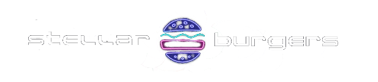

<!-- PROJECT LOGO -->
<a name="readme-top"></a>
<div align="center">



</div>
<div align="center">
    <h3 align="center">Part II: тестирование API</h3>
    <p align="center">
        Вторая часть дипломного проекта курса "qa-automation-engineer-java".
        <br/>
        <br/>
    </p>
</div>

<!-- TABLE OF CONTENTS -->
<details>
  <summary>Содержание:</summary>
  <ol>
    <li><a href="#about-the-project">О проекте</a></li>
    <li><a href="#usage">Запуск</a></li>
    <li><a href="#classes">Классы</a></li>
    <li><a href="#tests">Тесты</a></li>
    <li><a href="#tech-stack">Стек</a></li>
  </ol>
</details>

## О проекте
<a name="readme-top"></a>
Необходимо протестировать API для <a href="https://stellarburgers.nomoreparties.site/">Stellar Burgers</a>.
Документация <a href="https://code.s3.yandex.net/qa-automation-engineer/java/cheatsheets/paid-track/diplom/api-documentation.pdf">API</a>.

<b>Создание пользователя:</b>
* создать уникального пользователя;
* создать пользователя, который уже зарегистрирован;
* создать пользователя и не заполнить одно из обязательных полей.
    
<b>Логин пользователя:</b>
* логин под существующим пользователем;
* логин с неверным логином и паролем.

<b>Изменение данных пользователя:</b>
* с авторизацией;
* без авторизации.
<p>Для обеих ситуаций нужно проверить, что любое поле можно изменить. Для неавторизованного пользователя — ещё и то, что система вернёт ошибку.</p>
  
<b>Создание заказа:</b>
* с авторизацией;
* без авторизации;
* с ингредиентами;
* без ингредиентов;
* с неверным хешем ингредиентов.

<b>Получение заказов конкретного пользователя:</b>
* авторизованный пользователь;
* неавторизованный пользователь.

## Запуск
<a name="readme-top"></a>
Для запуска тестов в терминале выполнить команду 
```
mvn clean test
```
Для запуска отчета Allure выполнить команду 
```
mvn allure:serve
```

## Классы
<a name="readme-top"></a>
* `Endpoints` - тестируемые эндпоинты
* `Specification` - базовая спецификация запроса API
* `IngtClient` `OrderClient` `UserClient` - утилитарные классы для взаимодействия с сущностями модели
* `RandomUser` - генерация тестовых данных
* `Ingredient` `Order` `User` - pojo классы, описывающие сущности модели д. сериализации/десериализации данных

## Тесты
<a name="readme-top"></a>
* `UserRegistrationTest` - регистрация пользователя
* `UserRegistrationWithoutRequiredFieldTest` - регистрация пользователя без обязательных полей
* `UpdateUserTest` - обновление информации пользователя
* `ExistingUserAuthorizationTest` - регистрация существующего пользователя 
  

* `CreateOrderTest` - создание заказа
* `GettingUserOrders` - получение заказов

## Стек
<a name="readme-top"></a>
[![Java11][java]][javadoc-url]
[![JUnit4][junit]][junit-url]
[![REST Assured][REST_Assured]][rest-assured-url]
[![Gson][Gson]][Gson-url]
[![Allure][Allure]][Allure-url]
[![Git][git]][git-url]

<p align="right">(<a href="#readme-top">вверх</a>)</p>

<!-- MARKDOWN LINKS & IMAGES -->
<!-- https://www.markdownguide.org/basic-syntax/#reference-style-links -->
[javadoc-url]: https://docs.oracle.com/en/java/javase/11/docs/api/index.html
[java]: https://img.shields.io/badge/Java_11-FF2D20?style=for-the-badge&logo=data:image/png;base64,iVBORw0KGgoAAAANSUhEUgAAAA4AAAAOCAYAAAAfSC3RAAABEklEQVQokY3RvSv3URgG8M8RSQbvFCaZEGVhUSabDJIyiUEy+AueMvkjTPZnIyuTREopixhEiqe8JG895atTR33j+/vlqtN9Xq6r676vIyLLslJrNMuyrvzbFyqUxwJ6ihjlhNOowm4Rr5RwBkvYwSSqfyMcSS1uojnV198Ip3CNIdzipqilIKWaQz3m8IR5DOdMPkIIPxyjYBkd+Itn7KMbA/iD2S9yZU7YlOZrxyFacJre3jGBM6wXtdqAcTygFf+xgUWcYzuE8O+7Y8Q9+tCIl0SOia6WCmclOa2lFAfjNR6xl7K4jCmHEN7ywvgFY6jFMe5Qg070p/MWTkIIR0Uz9qIt7evSnLHGWQ9wEUK4gk/GbGLgemy9KAAAAABJRU5ErkJggg==

[junit-url]: https://junit.org/junit4/
[junit]: https://img.shields.io/badge/JUnit_4-282C36?style=for-the-badge&logo=data:image/png;base64,iVBORw0KGgoAAAANSUhEUgAAAA4AAAAOCAYAAAAfSC3RAAABKGlDQ1BBcHBsZSBSR0IAACiRlY89S8NQFIaf24qCQxEJbsLFQVzEj61j0pYiONQokmRrkksVbXK5uX508k/4IxxcHAX9BxUHwcmf4CaIg4NDhAwFi8/0nPfA4T1QW3PbXqe2AMPMGr/rySCM5Nwzs9QBoJ8U2u31dgGyPFNM8PmKAHhZd9teZ3L/J/OJNhb4BrZTVSQgNoH0wmoL4hpw4hNtQdwAjjnwWyAegMag9DHQiEt/AxomCCMQ74AzCMIIagBOXLoDOFZdWoBWrkfmeHBk5Vaz2ZRumsdK7o8Kq4aF3MmS3Ojc9K1KgbJf2dvV+lRJv+v98+FpBGEkS/vYQwBiaVxlFcmZOf9VIZ6mz9WN0SO4PszcV9nhF9xuwHK9ylZXYPEK7vQP8cBQPfXa6rwAAAAJcEhZcwAALiMAAC4jAXilP3YAAAcfaVRYdFhNTDpjb20uYWRvYmUueG1wAAAAAAA8P3hwYWNrZXQgYmVnaW49Iu+7vyIgaWQ9Ilc1TTBNcENlaGlIenJlU3pOVGN6a2M5ZCI/PiA8eDp4bXBtZXRhIHhtbG5zOng9ImFkb2JlOm5zOm1ldGEvIiB4OnhtcHRrPSJBZG9iZSBYTVAgQ29yZSA2LjAtYzAwMiAxMTYuMTY0NzY2LCAyMDIxLzAyLzE5LTIzOjEwOjA3ICAgICAgICAiPiA8cmRmOlJERiB4bWxuczpyZGY9Imh0dHA6Ly93d3cudzMub3JnLzE5OTkvMDIvMjItcmRmLXN5bnRheC1ucyMiPiA8cmRmOkRlc2NyaXB0aW9uIHJkZjphYm91dD0iIiB4bWxuczp4bXA9Imh0dHA6Ly9ucy5hZG9iZS5jb20veGFwLzEuMC8iIHhtbG5zOmRjPSJodHRwOi8vcHVybC5vcmcvZGMvZWxlbWVudHMvMS4xLyIgeG1sbnM6cGhvdG9zaG9wPSJodHRwOi8vbnMuYWRvYmUuY29tL3Bob3Rvc2hvcC8xLjAvIiB4bWxuczp4bXBNTT0iaHR0cDovL25zLmFkb2JlLmNvbS94YXAvMS4wL21tLyIgeG1sbnM6c3RFdnQ9Imh0dHA6Ly9ucy5hZG9iZS5jb20veGFwLzEuMC9zVHlwZS9SZXNvdXJjZUV2ZW50IyIgeG1wOkNyZWF0b3JUb29sPSJBZG9iZSBQaG90b3Nob3AgMjEuMiAoV2luZG93cykiIHhtcDpDcmVhdGVEYXRlPSIyMDIwLTA3LTE2VDExOjEyOjExKzAyOjAwIiB4bXA6TW9kaWZ5RGF0ZT0iMjAyMy0wNS0wOFQxMzo0NzowNyswMzowMCIgeG1wOk1ldGFkYXRhRGF0ZT0iMjAyMy0wNS0wOFQxMzo0NzowNyswMzowMCIgZGM6Zm9ybWF0PSJpbWFnZS9wbmciIHBob3Rvc2hvcDpDb2xvck1vZGU9IjMiIHBob3Rvc2hvcDpJQ0NQcm9maWxlPSJBcHBsZSBSR0IiIHhtcE1NOkluc3RhbmNlSUQ9InhtcC5paWQ6YmNlMjUxZDMtYTU2Yi1jMTQxLWJlY2QtMzliZGQ3YTVkMjAwIiB4bXBNTTpEb2N1bWVudElEPSJhZG9iZTpkb2NpZDpwaG90b3Nob3A6NWE0ODY2Y2YtZjE5NS01ZTQ5LWI4NTEtZTdkMmFiNjFlZTVmIiB4bXBNTTpPcmlnaW5hbERvY3VtZW50SUQ9InhtcC5kaWQ6MjAyMjA3OWUtNjhkZi0wMTRlLTk2ZjEtYzY5Yjk0ZDJhZmFhIj4gPHhtcE1NOkhpc3Rvcnk+IDxyZGY6U2VxPiA8cmRmOmxpIHN0RXZ0OmFjdGlvbj0iY3JlYXRlZCIgc3RFdnQ6aW5zdGFuY2VJRD0ieG1wLmlpZDoyMDIyMDc5ZS02OGRmLTAxNGUtOTZmMS1jNjliOTRkMmFmYWEiIHN0RXZ0OndoZW49IjIwMjAtMDctMTZUMTE6MTI6MTErMDI6MDAiIHN0RXZ0OnNvZnR3YXJlQWdlbnQ9IkFkb2JlIFBob3Rvc2hvcCAyMS4yIChXaW5kb3dzKSIvPiA8cmRmOmxpIHN0RXZ0OmFjdGlvbj0iY29udmVydGVkIiBzdEV2dDpwYXJhbWV0ZXJzPSJmcm9tIGFwcGxpY2F0aW9uL3ZuZC5hZG9iZS5waG90b3Nob3AgdG8gaW1hZ2UvcG5nIi8+IDxyZGY6bGkgc3RFdnQ6YWN0aW9uPSJzYXZlZCIgc3RFdnQ6aW5zdGFuY2VJRD0ieG1wLmlpZDozN2ExNjM4Mi1hYWI4LThjNDgtYWMxZi1jZDIxOGI0Y2NjYjAiIHN0RXZ0OndoZW49IjIwMjAtMDctMTdUMTI6MDg6MzcrMDI6MDAiIHN0RXZ0OnNvZnR3YXJlQWdlbnQ9IkFkb2JlIFBob3Rvc2hvcCAyMS4yIChXaW5kb3dzKSIgc3RFdnQ6Y2hhbmdlZD0iLyIvPiA8cmRmOmxpIHN0RXZ0OmFjdGlvbj0ic2F2ZWQiIHN0RXZ0Omluc3RhbmNlSUQ9InhtcC5paWQ6YmNlMjUxZDMtYTU2Yi1jMTQxLWJlY2QtMzliZGQ3YTVkMjAwIiBzdEV2dDp3aGVuPSIyMDIzLTA1LTA4VDEzOjQ3OjA3KzAzOjAwIiBzdEV2dDpzb2Z0d2FyZUFnZW50PSJBZG9iZSBQaG90b3Nob3AgMjEuMiAoV2luZG93cykiIHN0RXZ0OmNoYW5nZWQ9Ii8iLz4gPC9yZGY6U2VxPiA8L3htcE1NOkhpc3Rvcnk+IDwvcmRmOkRlc2NyaXB0aW9uPiA8L3JkZjpSREY+IDwveDp4bXBtZXRhPiA8P3hwYWNrZXQgZW5kPSJyIj8+rgL30gAAAe1JREFUKJF1kktoE1EYhb9773TyahjQVG1Q0lopaIvLEjeuTdSC1U0RXLjQhY8goouCEaKtiAgWRFyKiAtBRfCJG12JOxcKotGmndRHoE0b85xkZlyEyDTgWZ+Pw/nPL7ITSbq0OWw5R8ywNnowucEB8UF33LtAwWuSXdBNwFRaz7T1pzQ5v2Qebrqta0rI38D0/8B3wAmhFMWfC/QPbeft8TvEghGKjTLAFPCiG7wBxAGcSgU74Cc2lWG3P4qh+WnYzY5/D5DugANACkAoRSP3nY2pc4hAEMo1XKUQa+tcAHZK4EA7W2LlTYzkOEZyP4tnT0IogJDdZ0AD9kpgFMC1LHBdopeuUrg1Sz37BQS4rtsNAgxKb1p/+jL1z58wz5xHBYIAfF39QbFeQlc9a0gJfLSLy4TG4hiJfQipGH71nE1XrgPwZnyGoyMJ5kq/vNycBB4LpSGkYuXRA6y8idB9ONUKAKVmjbrdRIl/XVvAM5GdSCKUNuvUKqetxTxCKezVFXqHdzDw9DXb7h/jWyHHSN9WrPYsF4GMBuDarZTQfWO+waE4gFatYfWt5+H8eyJ+g2o40oFeAplOx4520X45evUAy7USh56kWSgXMPQQwAyQ8G7i1Sngtu04k5rUtsTWRV0gZzvOPSDrNf4FFAGtvY6aedYAAAAASUVORK5CYII=


[Allure-url]: https://docs.qameta.io/allure/
[Allure]: https://img.shields.io/badge/Allure-586B48?style=for-the-badge&logo=data:image/png;base64,iVBORw0KGgoAAAANSUhEUgAAAA4AAAAOCAYAAAAfSC3RAAABKGlDQ1BBcHBsZSBSR0IAACiRlY89S8NQFIaf24qCQxEJbsLFQVzEj61j0pYiONQokmRrkksVbXK5uX508k/4IxxcHAX9BxUHwcmf4CaIg4NDhAwFi8/0nPfA4T1QW3PbXqe2AMPMGr/rySCM5Nwzs9QBoJ8U2u31dgGyPFNM8PmKAHhZd9teZ3L/J/OJNhb4BrZTVSQgNoH0wmoL4hpw4hNtQdwAjjnwWyAegMag9DHQiEt/AxomCCMQ74AzCMIIagBOXLoDOFZdWoBWrkfmeHBk5Vaz2ZRumsdK7o8Kq4aF3MmS3Ojc9K1KgbJf2dvV+lRJv+v98+FpBGEkS/vYQwBiaVxlFcmZOf9VIZ6mz9WN0SO4PszcV9nhF9xuwHK9ylZXYPEK7vQP8cBQPfXa6rwAAAAJcEhZcwAACxMAAAsTAQCanBgAAAUPaVRYdFhNTDpjb20uYWRvYmUueG1wAAAAAAA8P3hwYWNrZXQgYmVnaW49Iu+7vyIgaWQ9Ilc1TTBNcENlaGlIenJlU3pOVGN6a2M5ZCI/PiA8eDp4bXBtZXRhIHhtbG5zOng9ImFkb2JlOm5zOm1ldGEvIiB4OnhtcHRrPSJBZG9iZSBYTVAgQ29yZSA2LjAtYzAwMiAxMTYuMTY0NzY2LCAyMDIxLzAyLzE5LTIzOjEwOjA3ICAgICAgICAiPiA8cmRmOlJERiB4bWxuczpyZGY9Imh0dHA6Ly93d3cudzMub3JnLzE5OTkvMDIvMjItcmRmLXN5bnRheC1ucyMiPiA8cmRmOkRlc2NyaXB0aW9uIHJkZjphYm91dD0iIiB4bWxuczp4bXA9Imh0dHA6Ly9ucy5hZG9iZS5jb20veGFwLzEuMC8iIHhtbG5zOmRjPSJodHRwOi8vcHVybC5vcmcvZGMvZWxlbWVudHMvMS4xLyIgeG1sbnM6cGhvdG9zaG9wPSJodHRwOi8vbnMuYWRvYmUuY29tL3Bob3Rvc2hvcC8xLjAvIiB4bWxuczp4bXBNTT0iaHR0cDovL25zLmFkb2JlLmNvbS94YXAvMS4wL21tLyIgeG1sbnM6c3RFdnQ9Imh0dHA6Ly9ucy5hZG9iZS5jb20veGFwLzEuMC9zVHlwZS9SZXNvdXJjZUV2ZW50IyIgeG1wOkNyZWF0b3JUb29sPSJBZG9iZSBQaG90b3Nob3AgMjEuMiAoV2luZG93cykiIHhtcDpDcmVhdGVEYXRlPSIyMDIzLTA1LTA4VDEzOjQyOjAxKzAzOjAwIiB4bXA6TW9kaWZ5RGF0ZT0iMjAyMy0wNS0wOFQxMzo0NjozOSswMzowMCIgeG1wOk1ldGFkYXRhRGF0ZT0iMjAyMy0wNS0wOFQxMzo0NjozOSswMzowMCIgZGM6Zm9ybWF0PSJpbWFnZS9wbmciIHBob3Rvc2hvcDpDb2xvck1vZGU9IjMiIHBob3Rvc2hvcDpJQ0NQcm9maWxlPSJBcHBsZSBSR0IiIHhtcE1NOkluc3RhbmNlSUQ9InhtcC5paWQ6MjBhNmQzNzMtMDZhYi0yOTRlLThhYmYtMTMyN2UzNjJmMmRhIiB4bXBNTTpEb2N1bWVudElEPSJ4bXAuZGlkOjIwYTZkMzczLTA2YWItMjk0ZS04YWJmLTEzMjdlMzYyZjJkYSIgeG1wTU06T3JpZ2luYWxEb2N1bWVudElEPSJ4bXAuZGlkOjIwYTZkMzczLTA2YWItMjk0ZS04YWJmLTEzMjdlMzYyZjJkYSI+IDx4bXBNTTpIaXN0b3J5PiA8cmRmOlNlcT4gPHJkZjpsaSBzdEV2dDphY3Rpb249ImNyZWF0ZWQiIHN0RXZ0Omluc3RhbmNlSUQ9InhtcC5paWQ6MjBhNmQzNzMtMDZhYi0yOTRlLThhYmYtMTMyN2UzNjJmMmRhIiBzdEV2dDp3aGVuPSIyMDIzLTA1LTA4VDEzOjQyOjAxKzAzOjAwIiBzdEV2dDpzb2Z0d2FyZUFnZW50PSJBZG9iZSBQaG90b3Nob3AgMjEuMiAoV2luZG93cykiLz4gPC9yZGY6U2VxPiA8L3htcE1NOkhpc3Rvcnk+IDwvcmRmOkRlc2NyaXB0aW9uPiA8L3JkZjpSREY+IDwveDp4bXBtZXRhPiA8P3hwYWNrZXQgZW5kPSJyIj8+7ZBgXAAAAk1JREFUKJE9kj1oVEEUhb87M+89djeJiWuzahHUgEUQ/ENB7YMGFCQqaCEaY7AwFloIprESQQvBQkQEQSzESkXETuy0SBuVBInkZ901Ji/Z3fczMxa7esoL3zlw7hHvAeDVzHEW4gqRblWaLhwuNPM95x9+l6Dhpnwob8X9nGsVTmC238c4MHQU6IxWGt01kt0gAkQAAQEvCnH2QUhzQm1on81UdRCA1bj7nXZ2CC1I22sKsCB7IQeVX63q/r09H93h4jqY97NDOCu3u008VDINrKinoUlu4fW84MFlm5T/dWspGp/4YY8eKq5/emRSdVlt7Z7b2BcuT2plEc9LrfwFg50HoQ3O1prBmWvV4OKTyNZxlWRMlelXy3nvKek0tBYGo7HWrOgS1gu6ucSf5BJfV8bQ9YVRScLcr3XREnXaBEm+24lCK/u1HMWreCE10FVaoF4+xlLPScJgGk2CQr4gHMRLv3FKHO1Ao1NwKoWsSeH3YXrGa5SjSbDtJvGi8AKCUgr7WcRjrd72y/SWq4UNuLkR8tkjaLMIktKpOUD8PpQDcU4p0S8FwXtLUKw+21Lbxeb5nfhiHW8VZBqMAW2ekxpFbiA3qEy5WLS+TqFFaXr/0XB68HWrVBv890xEdpDwgpQRFP9lVlu/sWF8r7JycHff4oGzaVQfznI9HGmZES8WLwO4jov4f1yo1uJF4sZPdFI6h+amaNY629kGDHSABOWuAO86oDXGRKALOMlQmjvFYvFFfblxPNIy0ImZIVp/QxZ9A/0BL+PgH/8FR9jzeBQEHXQAAAAASUVORK5CYII=

[Git]: https://img.shields.io/badge/Git-F44D27?style=for-the-badge&logo=git&logoColor=white
[Git-url]: https://git-scm.com/

[rest-assured-url]: https://rest-assured.io/
[REST_Assured]: https://img.shields.io/badge/rest_assured-00BB76?style=for-the-badge&logo=data:image/svg+xml;base64,PD94bWwgdmVyc2lvbj0iMS4wIiBzdGFuZGFsb25lPSJubyI/Pgo8IURPQ1RZUEUgc3ZnIFBVQkxJQyAiLS8vVzNDLy9EVEQgU1ZHIDIwMDEwOTA0Ly9FTiIKICJodHRwOi8vd3d3LnczLm9yZy9UUi8yMDAxL1JFQy1TVkctMjAwMTA5MDQvRFREL3N2ZzEwLmR0ZCI+CjxzdmcgdmVyc2lvbj0iMS4wIiB4bWxucz0iaHR0cDovL3d3dy53My5vcmcvMjAwMC9zdmciCiB3aWR0aD0iNTAuMDAwMDAwcHQiIGhlaWdodD0iNTAuMDAwMDAwcHQiIHZpZXdCb3g9IjAgMCA1MC4wMDAwMDAgNTAuMDAwMDAwIgogcHJlc2VydmVBc3BlY3RSYXRpbz0ieE1pZFlNaWQgbWVldCI+Cgo8ZyB0cmFuc2Zvcm09InRyYW5zbGF0ZSgwLjAwMDAwMCw1MC4wMDAwMDApIHNjYWxlKDAuMTAwMDAwLC0wLjEwMDAwMCkiCmZpbGw9IiNGRkZGRkYiIHN0cm9rZT0ibm9uZSI+CjxwYXRoIGQ9Ik0xODAgNDkxIGMtNzEgLTIzIC0xMjIgLTY2IC0xNTYgLTEzMSAtMjYgLTUwIC0yNCAtMTUyIDQgLTIwNiAzOQotNzYgMzIgLTc5IDIxNSAxMDQgMTU4IDE1OCAxNjcgMTY5IDE1MCAxODQgLTUwIDQ0IC0xNTUgNjggLTIxMyA0OXogbTY5IC00NgpjLTIyIC0yMiAtMzAgLTI0IC03MiAtMTkgLTI1IDQgLTQ0IDEwIC00MSAxNSA3IDEyIDYzIDI3IDEwNCAyOCBsMzUgMSAtMjYKLTI1eiBtOTEgMCBjMzcgLTE5IDM3IC0yMiA0IC01NiBsLTI2IC0yOCAtMzQgMjIgLTMzIDIyIDI2IDI4IGMzMSAzMiAyNiAzMQo2MyAxMnogbS0xNTAgLTU1IGMwIC00IC02IC0xMyAtMTQgLTE5IC0xMSAtMTAgLTE5IC04IC0zNSA2IC0yOSAyNCAtMjYgMzAgMTQKMjUgMTkgLTIgMzUgLTggMzUgLTEyeiBtLTYwIC02NCBjLTIwIC0yNSAtMzAgLTE5IC0zMCAyMSBsMCAzNyAyMiAtMjEgYzE4Ci0xOCAxOSAtMjQgOCAtMzd6IG0xMzAgMzkgYzM2IC0xOSAzNyAtMjUgNiAtNTQgLTI0IC0yMyAtMjUgLTIzIC01MCAtNSAtMzAKMjIgLTMyIDMxIC05IDU2IDE5IDIyIDE3IDIyIDUzIDN6IG0tMTk2IC0xMDYgYy05IC0xMSAtMjIgLTE5IC0yNyAtMTkgLTEyIDAKLTIgODMgMTUgMTEzIDExIDIwIDEzIDE5IDIwIC0yNyA3IC00MCA2IC01MiAtOCAtNjd6IG0xMjkgLTIxIGMtMTUgLTE1IC0yOQotMjggLTMzIC0yOCAtMyAwIC0xNCAxNCAtMjQgMzEgLTE4IDMwIC0xOCAzMSA1IDU1IGwyMyAyNCAyOCAtMjcgMjggLTI3IC0yNwotMjh6IG0tNzQgLTE5IGwyMyAtMzEgLTI4IC0yOSBjLTE1IC0xNiAtMzAgLTI5IC0zNCAtMjkgLTMgMCAtMTQgMTQgLTI0IDMxCi0xOCAzMSAtMTggMzEgMTAgNjAgMTUgMTYgMjggMjkgMjkgMjkgMSAwIDEyIC0xNCAyNCAtMzF6Ii8+CjxwYXRoIGQ9Ik0yNTcgMjQyIGMtMTg0IC0xODQgLTE3OSAtMTc0IC05NiAtMjExIDEwMCAtNDYgMjMyIC0xMSAyOTMgNzYgMjMKMzMgMzAgNTUgMzQgMTExIDUgNzYgLTYgMTIyIC00MSAxNjUgbC0yMiAyOCAtMTY4IC0xNjl6IG0yMDMgNzIgYzAgLTUgLTEzCi0yMiAtMjggLTM3IGwtMjggLTI3IC0yMiAzMCBjLTEyIDE2IC0yMiAzMiAtMjIgMzUgMCAzIDE1IDE4IDMyIDM0IGwzMyAyOSAxNwotMjYgYzEwIC0xNSAxOCAtMzIgMTggLTM4eiBtLTgwIC03OSBjLTEgLTUgLTEwIC0yMSAtMjEgLTM0IGwtMjAgLTI1IC0zMSAzMQotMzEgMzEgMzQgMzAgMzQgMzAgMTcgLTI2IGMxMCAtMTUgMTggLTMxIDE4IC0zN3ogbTkwIC01IGMwIC0yMiAtNyAtNTcgLTE2Ci03OCBsLTE2IC0zNyAtMTMgNTMgYy0xMiA1MCAtMTEgNTUgOSA3NyAzMCAzMyAzNiAzMCAzNiAtMTV6IG0tMTc1IC00MCBsMjgKLTI5IC0yNCAtMjAgYy0zMCAtMjUgLTM4IC0yNSAtNjggLTIgbC0yNCAxOSAyNCAzMCBjMTMgMTcgMjcgMzEgMzAgMzEgMyAxIDE4Ci0xMiAzNCAtMjl6IG0xMTAgLTI2IGM4IC00NSAwIC01NCAtMjYgLTI3IC0xOCAxOCAtMTkgMjMgLTggNDIgMTkgMjkgMjYgMjYKMzQgLTE1eiBtLTE4MiAtNDMgYzM0IC0xOCAzMyAtMzAgLTMgLTU5IC0yOCAtMjIgLTMwIC0yMiAtNjIgLTYgLTE4IDkgLTM1IDE4Ci0zNiAyMCAtNSA0IDYyIDY0IDY4IDYxIDMgLTIgMTcgLTkgMzMgLTE2eiBtMTQ4IC03IGwyNCAtMjYgLTQ1IDcgYy01NSA5IC01OAoxMiAtMzQgMzAgMjUgMTkgMjcgMTkgNTUgLTExeiBtLTMgLTM3IGM5IDQgMTMgMSAxMCAtNyAtMiAtOCAtMjAgLTE5IC0zOSAtMjYKLTM1IC0xMyAtMTA5IC0xOCAtMTA5IC05IDAgMyAxMiAxNiAyNyAyOSAyMiAxOSAzMyAyMiA2MSAxNSAxOSAtNCA0MSAtNSA1MAotMnoiLz4KPC9nPgo8L3N2Zz4K

[Gson-url]: https://github.com/google/gson
[Gson]: https://img.shields.io/badge/Gson-4e6f58?style=for-the-badge&logo=google&logoColor=white
